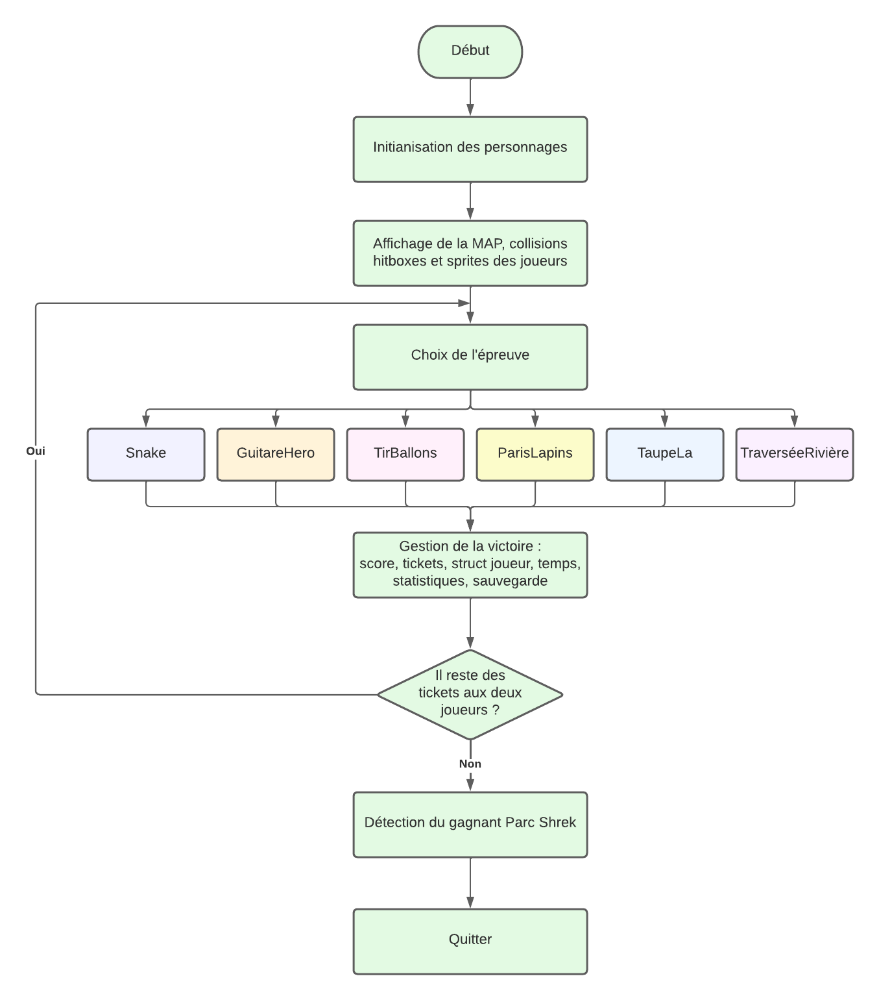

<!--
# Style lead only for this slide
_class: lead
-->

Projet d'informatique
Algorithmique et langage C : 

# SHREK WORLD 

 

* Thaïs LECLAIRE
* Thomas Leroy
* Guy-Charbel KAIROUZ
* Lucie Daix

 

2022-2023

---
# Sommaire

 

* Présentation du jeu
* Organisation des jeux 
* Preuve de conception
* Repartion du travail
* Bilan

---

# Présentation du jeu 

 

Règles : 
* 2 joueurs s'affrontes autour de 6 éprevues
* le premier qui n'a plus de ticket a perdu

----

# Organisation des jeux 
---

# Jeux 1
---

# Jeux 2 

---

# Preuve de conception

 

Schémas qui montrent la gestion des ... dans les 6 jeux 

---

schémas qui illustrent la gestion des sprites

 ---

# Contrivution github 
 

* 4 contributeurs
* ... commits
* ... branches

.png)
 
 

---

# bilan 

expérience acquises

//perso thaïs + autre diapo 1er semestre

