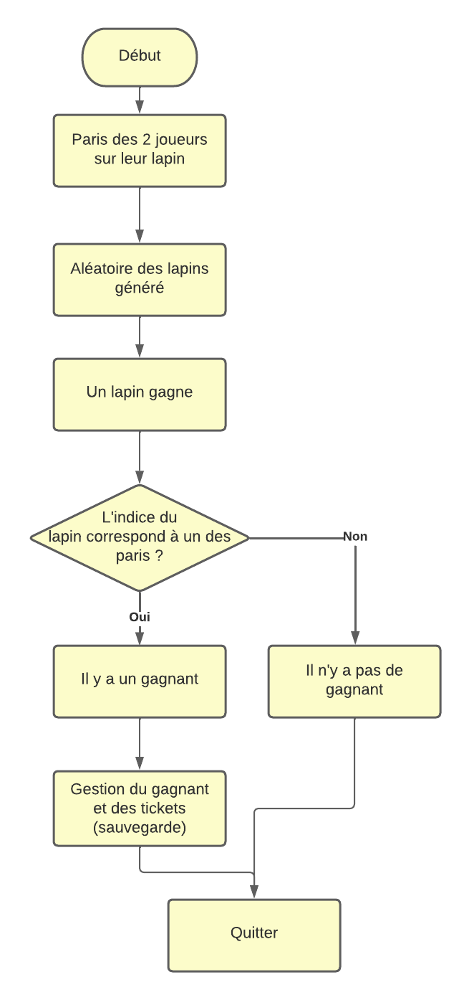
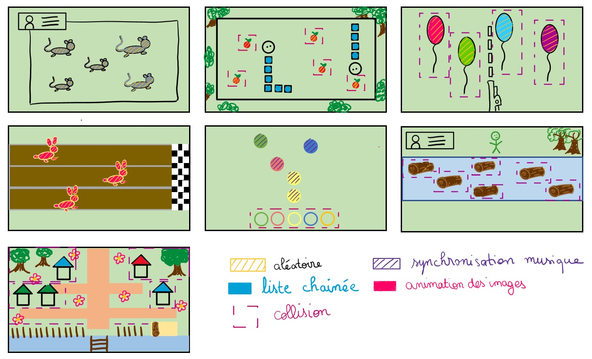

<!--
# Style lead only for this slide
_class: lead
-->


Projet d'informatique
Algorithmique et langage C 


# SHREK WORLD 

<br>

<br>
<br>

2022-2023

---

# Equipe 20


<br>
<br>

* Thaïs LECLAIRE
* Thomas LEROY
* Guy-Charbel KAIROUZ
* Lucie DAIX


---
# Sommaire

<br>

* Présentation du jeu
* Organisation des jeux 
* Preuves de conceptions
* Repartion du travail
* Bilan


---

# Présentation du jeu 

<br>

Règles : 
* Deux joueurs s'affrontent autour de 6 éprevues
* Le premier qui n'a plus de ticket a perdu


---

# Organisation des jeux `1/2`

* Les jeux sont créés dans des dossiers éponymes
* De manière générale, il y a un sous-programme par fichier, stocké dans chaque dossier prévu à cet effet
* Chaque jeu crée sa propre file d'événements, afin de simplifier l'implémentation de celles-ci
* Chaque jeu prend en paramètres le tableau de structures de joueurs (stockant les informations des utilisateurs tels que les tickets) ainsi que le tableau de stockage des temps de jeu (pour la sauvegarde)

---

# Organisation des jeux `2/2`


* Afin de rentrer dans un jeu le joueur doit interagir avec un des bâtiments de la carte
* Le classement est mis à jour à chaque sortie de jeu, via les sous-programmes de sauvegarde prévus à cet effet

---

# Menu et carte `1/3`

*Réalisé par: Thomas LEROY (50%) et Guy-Charbel KAIROUZ (50%)*

* Création de la carte sur `Tiled` à l'aide d'un tileset récupéré sur `itch.io`
* Mise en place d'un menu à l'aide des structures `DIALOG` d'Allegro
* Chaque maison correspond à un jeu et il est possible d'interagir avec le panneau pour afficher les statistiques
* Les boites de collisions ont été rajoutées par dessus la bitmap de la carte de jeu

---

# Menu et carte `2/3`

### Problèmes rencontrés

* Petits problèmes de direction artistique: en effet nous avons eu des difficultés à bien intégrer les différents éléments entre eux
* L'implémentation du menu de création du joueur a été compliquée, en raison du manque de documentation concernant ce sujet

---

# Menu et carte `3/3`


---

# Snake `1/5`

*Réalisé par: Thomas LEROY (100%)*

* Gestion des serpents par liste chaînée
* Déplacement des serpents
* Apparition et gestion des pommes
* Collisions


---

# Snake `2/5`

### Structures de données utilisées

```C
typedef struct Maillon {
    BITMAP* Skin[12];
    int skin_used;
    int x,y;
    int last_x[TAILLE_TAB],last_y[TAILLE_TAB];
    int tx,ty;
    int dx,dy;
    struct Maillon* next_corp;
}t_corp_de_snake;
```

---

# Snake `3/5`

```C
typedef struct Pomme{
    int x,y;
    BITMAP* Skin;
}t_Pomme;

```

### Tableaux importants

```C
BITMAP* SNAKE1[12];
t_corp_de_snake* head[NOMBRE_JOUEURS] = {NULL,NULL};
t_hitbox tab_hitboxes[4];
t_Pomme Pomme [2];
int Serpent_en_vie[NOMBRE_JOUEURS];
```

---

# Snake `4/5`

### Prototypes

```C
void Snake(t_joueur* Joueur, int tab_temps[NOMBRE_JOUEURS]);

t_corp_de_snake* Creer_maillon(BITMAP* tab_de_Skin[12]);

void Actualisation_Snake(t_corp_de_snake* head);

void Ajout_de_Longueur(t_corp_de_snake* Head,BITMAP* Tab_de_sprites[12],int* Longueur);

int Collision_Acteur(t_corp_de_snake* head,t_corp_de_snake* corp);

void Interaction_Pomme(t_corp_de_snake* head,t_Pomme* Pomme,int *Longeur,BITMAP* tab_de_Skin[12]);

void Mort_de_serpent(t_corp_de_snake * head);
```

---

# Snake `5/5`

### Algorigramme

---

# Guitar Hero `1/9`

*Réalisé par: Guy-Charbel KAIROUZ (100%)*

* Plusieurs chansons sélectionnables
* Cercles défilant à l'écran en rythme avec la musique
* Détection des touches et du *momentum* d'appui


---

# Guitar Hero `2/9`

### Conversion des fichiers `.MIDI` en fichiers `.CSV`

* Les paritions proviennent du site web `musescore.com` regroupant un panel de contenu proposé par la communauté et libre de droit
* On utilise le logiciel `midicsv.exe` afin de réaliser cette conversion

Les fichiers `.CSV` contiennent alors les temps de jeu de chaque note en fonction du tempo de la musique. Nous allons utiliser ces données de temps pour générer les notes du jeu

---

# Guitar Hero `3/9`

### Lecture des fichiers `.CSV`

* On lit les fichiers `.CSV` en stockant chaque note et son temps d'apparition dans un tableau de structures `t_note`

* On adapte le temps d'apparition des notes au tempo de la musique

* Enfin, on *map* les notes sur 5 différentes cordes afin de profiter de toute la largeur de l'interface même dans les musiques ayant de faibles amplitudes de notes

---

# Guitar Hero `4/9`

### Génération des cercles des notes

* En démarrant un chronomètre s'actualisant à chaque itération de boucle, on peut faire apparaitre les notes avec une précision satisfaisante

* La musique démarre lorsque le cercle de la première note atteinte le bas de l'écran

---

# Guitar Hero `5/9`

### Détection des touches

* Détection de collision entre les cercles tombant et les cercles fixes présents dans le bas de l'interface

* Si un cercle passe sans appui du joueur, celui-ci perd

* Afin de rendre le jeu moins punitif, certaines règles ont été allégées: le joueur ne perd *pas* s'il appuie sur une touche sans qu'aucun cercle ne soit présent

---

# Guitar Hero `6/9`

### Structures de données utilisées

```C
typedef struct note_musique {
    int note;
    int millis;
    int portee;
    int x_centre;
    int y_centre;
    int radius;
    int couleur;
    float dy;
    int affichage;
} t_note;
```

---

# Guitar Hero `7/9`

```C
typedef struct cercle_fixe {
    int x_centre;
    int y_centre;
    int radius;
    int couleur;
} t_cercle_fixe;
```

### Tableaux importants

```C
t_cercle_fixe tableau_cercles_fixes[5];
t_note * chanson_jouee; // Contenant les notes de la chanson sélectionnée
```

---

# Guitar Hero `8/9`

### Prototypes

```C
void guitar_hero(t_joueur * tab_joueurs, t_entree_sauvegarde tab_donnees[NOMBRE_JOUEURS]);

t_note * charger_musique(char nom_musique[256], int * taille_tab, int * tempo);

void actualiser_tab_cercles(BITMAP * bmp, t_note * tableau_notes, int taille_tab);

int collision_cercles(t_cercle_fixe *a1, t_note *a2);

void detection_touches(t_note * portee_1, int index_1, int * index_note_jouee_1, 
t_note * portee_2, int index_2, int * index_note_jouee_2,
t_cercle_fixe * tab_cercles_fixes, int * alive, int mono_portee, t_joueur * joueur_actuel);
```

---

# Guitar Hero `9/9`

### Algorigramme

---

# Tir ballons `1/7`

*Réalisé par: Thaïs LECLAIRE (100%)*

* Gestion des ballons aléatoires 
* Déplacement des ballons (vitesse et positions)
* Collisions entre les tirs et les ballons


---

# Tir ballons `2/7`

### Structures de données utilisées

```C
typedef struct acteur
{
    int x,y; // position du coin supérieur gauche
    int dx,dy; // vecteur déplacement
    int tx,ty; // largeur hauteur de l'image
    int couleur;
    int comportement; // comportement : 0 normal et 1 explosion
    int cptexplo; // temps depuis l'explosion
    int vivant; // vivant : 0 mort (doit disparaitre de la liste) et 1 vivant

} t_acteur;
```

---

# Tir ballons `3/7`

```C
typedef struct joueur_ballons {
    int x,y;     // position
    int tx,ty;   // taille
    int vit;     // vitesse des déplacements (nombre de pixels)
    int cpttir0; // tempo armement 0
    int cpttir1; // tempo armement 1
    BITMAP *img; // sprite (image chargée)
} t_joueur_ballons;

```
---
# Tir ballons `4/7`

```C
typedef struct ballon {
    int x,y;     // position
    int dx, dy;      // vecteur déplacement
    int tx,ty;   // taille
    BITMAP *img; // sprite (image chargée)
    int couleur;
} t_ballon;

```

### Tableaux importants

```C
    t_joueur_tir_aux_ballons Joueur_actuel[NOMBRE_JOUEURS];
```

---

# Tir ballons `5/7`

### Prototypes

```C
void jeuballons(t_joueur joueur_ballons[NOMBRE_JOUEURS], int tab_tmp[NOMBRE_JOUEURS]);

t_acteur * creerActeur(int x,int y,int type);
t_acteur * ajouterActeur(t_listeActeurs *la,int x,int y,int type);
t_listeActeurs * creerListeActeurs(int maxacteurs);
void enleverActeur(t_listeActeurs *la,int i);
void actualiserActeur(t_acteur *acteur);
void actualiserListeActeurs(t_listeActeurs *la);
void dessinerActeur(BITMAP *bmp,t_acteur *acteur);
void dessinerListeActeurs(BITMAP *bmp,t_listeActeurs *la);
int libreListeActeurs(t_listeActeurs *la);

```

---
# Tir ballons `6/7`

### Prototypes

```C
t_joueur_ballons * creerJoueur(char *nomimage);
void actualiserJoueur(t_joueur_ballons *joueur,t_listeActeurs *la);
void dessinerJoueur(BITMAP *bmp,t_joueur_ballons *joueur);
void destinActeur(t_acteur *acteur);


void collisionActeur(t_ballon * ballon ,t_acteur * acteur);
void collisionListeActeurs(t_ballon *ballon,t_listeActeurs *la);

t_ballon * creerBallon(char *nomimage);
void actualiserBallon(t_ballon * ballon);
void dessinerBallon(BITMAP *bmp, t_ballon * ballon);
```

---
# Tir ballons `7/7`

### Algorigramme


---

# Run lapins `1/8`

*Réalisé par: Thaïs LECLAIRE (100%)*

* Gestion aléatoire de la vitesse des lapins  
* Collisions avec la ligne d'arrivée 
* Interface de dialogue pour le pari du joueur


---

# Course de lapins  `2/8`

### Structures de données utilisées

```C
typedef struct sequence
{
    char *nomSource; 
    int nimg;        
    int tx,ty;       
    int ncol;  // nbr images cotes à cotés horizontalement dans le fichier image
    BITMAP **img;    
} t_sequence;

```

---

# Course de lapins `3/8`

```C
typedef struct lapin
{
    int x,y;         
    int dx;        
    int tmpdx;       // ralentir déplacements en x (1 pour ne pas ralentir)
    int cptdx;       // compteur pour ralentir déplacement
    int tx,ty;      
    int imgcourante; // indice de l'image courante
    int tmpimg;      // ralentir séquence (image suivante 1 fois sur tmpimg)
    int cptimg;      // compteur pour ralentir séquence
    int type;  

} t_lapin;
```
---
# Course de lapins `4/8`

```C
typedef struct ballon {
    int x,y;     // position
    int dx, dy;  // vecteur déplacement
    int tx,ty;   // taille
    BITMAP *img; // sprite (image chargée)
    int couleur;
} t_ballon;

```

### Tableaux importants

```C
    int tab_paris[2] = {0, 0};
    int tab_joueurs[NOMBRE_JOUEURS];
```

---

# Course de lapins `6/8`

### Prototypes

<br>

```C
t_lapin * creerlapin(int type, int x, int y, int dx, int tmpdx, int tmpimg);
void remplirTablapins(t_lapin * tab[Nlapin]);
void actualiserlapin(t_lapin *lapin, int tabParis[2], int *alive, BITMAP *page, t_joueur tab_course[NOMBRE_JOUEURS]);
void actualiserTablapins(t_lapin * tab[Nlapin], int tabParis[2], int *alive, BITMAP *page, t_joueur tab_course[NOMBRE_JOUEURS]);
void dessinerlapin(BITMAP *bmp, t_lapin *lapin);
void dessinerTablapins(BITMAP *bmp,t_lapin * tab[Nlapin]);
void chargerSequence(t_sequence * seq);
void chargerTabSequences();

```

---
# Course de lapins `7/8`

### Prototypes

```C
t_joueur_ballons * creerJoueur(char *nomimage);
void actualiserJoueur(t_joueur_ballons *joueur,t_listeActeurs *la);
void dessinerJoueur(BITMAP *bmp,t_joueur_ballons *joueur);
void destinActeur(t_acteur *acteur);


void collisionActeur(t_ballon * ballon ,t_acteur * acteur);
void collisionListeActeurs(t_ballon *ballon,t_listeActeurs *la);

t_ballon * creerBallon(char *nomimage);
void actualiserBallon(t_ballon * ballon);
void dessinerBallon(BITMAP *bmp, t_ballon * ballon);
```

---
# Course de lapins `8/8`

### Algorigramme



---

# Système de sauvegarde (écriture) `1/2`

1- Création du fichier de sauvegarde ou s'il existe déjà, lecture de celui-ci

2- Récupération de toutes les donnéees stockées dans un tableau et ajout des données à sauvegarder dans celui-ci

3- Tri du tableau en fonction du score pour certains jeux ou du temps pour d'autres

4- Ecriture du tableau de données dans le fichier

---

# Système de sauvegarde (lecture) `2/2`

1- Parcours du fichier et stockage des données dans un tableau alloué

2- Affichage du tableau à l'écran à l'aide des routines `MENU` et `DIALOG` d'Allegro


---


# Preuves de conception

<br>




Schémas qui montrent la gestion des ... dans les 6 jeux 


---

schémas qui illustrent la gestion des sprites


---

# Investissement 


 
 
---

.png)


---


# bilan collectif 

expérience acquises

//perso thaïs + autre diapo 1er semestre

---

# Récapitulatif des jeux

| Jeu | Avancement | Problèmes / reste |
| --- | --- | --- |
| Course de lapins | 100% | - |
| Traversé de la rivière | 100% | - |
| Taupe-là !| 90% | Les taupes ne se cachent pas, elles restent afficher|


---

# Récapitulatif des jeux

| Jeu | Avancement | Problèmes / reste |
| --- | --- | --- |
| Snake | 100% | - |
| Guitar Hero | 100% | - |
| Tir aux ballons | 90% | Les ballons n'éclatent pas mais s'envolent |


